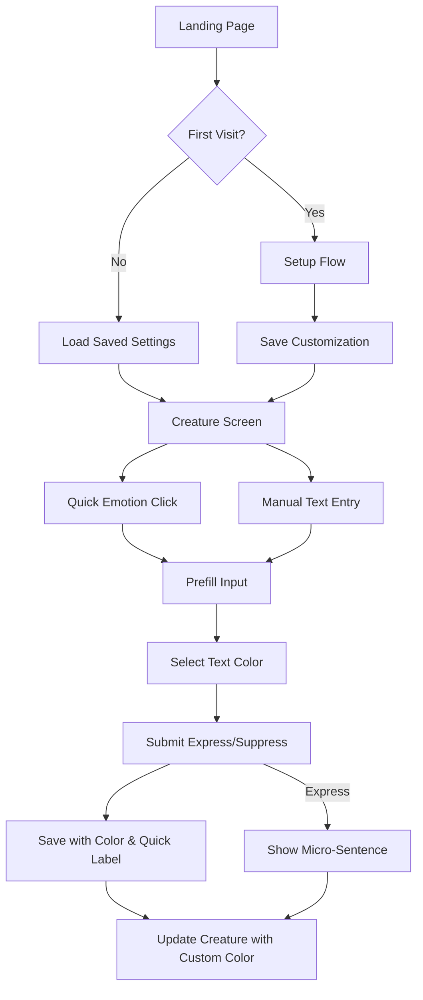

# Design Document

## Overview

This design extends the existing EmoChild application with three major feature sets: a landing/onboarding system, creature customization capabilities, and enhanced emotion input features. The implementation builds upon the existing Next.js architecture, React Context state management, and localStorage persistence layer.

The landing page serves as the entry point on every visit, explaining the app concept before transitioning to a setup flow for first-time users. The setup flow collects creature customization preferences (name, color from 8 pastel options, optional bow accessory) and stores them in localStorage. The emotion input screen gains quick emotion buttons for faster logging, text color selection for visual organization, and encouraging micro-sentences that cycle through 10 validation messages. The history view is enhanced with colored text display, delete functionality with confirmation, and visual dividers.

All new features maintain the existing privacy-first approach with local-only storage and no backend dependencies.

## Architecture

### Extended Technology Stack

The existing stack remains unchanged:
- **Framework**: Next.js 14+ (App Router)
- **Language**: TypeScript
- **Styling**: CSS Modules with CSS custom properties
- **State Management**: React Context API
- **Storage**: Browser localStorage API
- **Animation**: CSS transitions and keyframes
- **Testing**: Vitest for unit tests, fast-check for property-based tests

### Updated Application Structure

```
emochild/
├── src/
│   ├── app/
│   │   ├── layout.tsx
│   │   ├── page.tsx              # Landing page (NEW)
│   │   ├── setup/
│   │   │   └── page.tsx          # Setup flow (NEW)
│   │   ├── creature/
│   │   │   └── page.tsx          # Main creature screen (MOVED from root)
│   │   ├── history/
│   │   │   └── page.tsx          # Enhanced history view (UPDATED)
│   │   └── globals.css           # Extended color palette (UPDATED)
│   ├── components/
│   │   ├── LandingHero/          # Landing page hero (NEW)
│   │   ├── SetupForm/            # Creature customization form (NEW)
│   │   ├── ColorPicker/          # Reusable color selector (NEW)
│   │   ├── QuickEmotions/        # Quick emotion buttons (NEW)
│   │   ├── MicroSentence/        # Validation message display (NEW)
│   │   ├── EmotionInput/         # Enhanced with text color (UPDATED)
│   │   ├── Creature/             # Supports custom colors & bow (UPDATED)
│   │   ├── LogHistory/           # Delete & colored text (UPDATED)
│   │   └── [existing components]
│   ├── context/
│   │   └── EmotionContext.tsx    # Extended state (UPDATED)
│   ├── services/
│   │   └── storageService.ts     # New storage keys (UPDATED)
│   ├── types/
│   │   └── index.ts              # New types (UPDATED)
│   └── utils/
│       ├── microSentences.ts     # Sentence cycling logic (NEW)
│       └── [existing utils]
```

### Data Flow for New Features



## Components and Interfaces

### Extended Data Types

```typescript
// types/index.ts - NEW TYPES

export interface CreatureCustomization {
  name: string;
  color: PastelColor;
  hasBow: boolean;
}

export type PastelColor = 
  | 'mint'      // #C9E4DE
  | 'blue'      // #a0d2eb
  | 'lavender'  // #DBCDF0
  | 'peach'     // #fcded3
  | 'pink'      // #F2C6DE
  | 'yellow'    // #ffeaa7
  | 'red'       // #f35d69
  | 'orange';   // #ff964f

export type QuickEmotion = 
  | 'stressed'
  | 'anxious'
  | 'calm'
  | 'excited'
  | 'sad'
  | 'angry'
  | 'confused'
  | 'grateful'
  | 'curious'
  | 'scared';

export interface EmotionLog {
  id: string;
  text: string;
  action: EmotionAction;
  timestamp: number;
  textColor?: PastelColor | 'white';  // NEW
  quickEmotion?: QuickEmotion;        // NEW
}

export interface AppState {
  logs: EmotionLog[];
  creatureState: CreatureState;
  safetyScore: number;
  customization: CreatureCustomization;  // NEW
  microSentenceIndex: number;            // NEW
}
```

### New Component Interfaces

#### LandingHero Component

```typescript
interface LandingHeroProps {
  onStart: () => void;
}
```

Responsibilities:
- Display app name "EmoChild: Your Inner Child in Your Pocket"
- Show explanation text with pastel glow effect
- Render "Start" button
- Handle navigation to setup flow

#### SetupForm Component

```typescript
interface SetupFormProps {
  onComplete: (customization: CreatureCustomization) => void;
}
```

Responsibilities:
- Render name input field
- Display ColorPicker for creature color selection
- Show preview blob that updates with selected color
- Provide bow toggle checkbox
- Validate name is not empty
- Save to localStorage on completion
- Navigate to creature screen

#### ColorPicker Component

```typescript
interface ColorPickerProps {
  selectedColor: PastelColor | 'white';
  onColorChange: (color: PastelColor | 'white') => void;
  includeWhite?: boolean;  // For text color selector
  label?: string;
}
```

Responsibilities:
- Render color swatches for all pastel colors
- Highlight selected color
- Call onColorChange when user clicks a color
- Optionally include white option for text colors
- Display accessible labels

#### QuickEmotions Component

```typescript
interface QuickEmotionsProps {
  onEmotionSelect: (emotion: QuickEmotion) => void;
}
```

Responsibilities:
- Render 10 quick emotion buttons in a grid
- Apply appropriate styling to each button
- Call onEmotionSelect when clicked
- Maintain accessibility with proper labels

#### MicroSentence Component

```typescript
interface MicroSentenceProps {
  sentence: string;
  onDismiss: () => void;
}
```

Responsibilities:
- Display micro-sentence with fade-in animation
- Auto-dismiss after 2 seconds
- Allow manual dismissal
- Apply pastel glow effect

### Updated Component Interfaces

#### EmotionInput Component (UPDATED)

```typescript
interface EmotionInputProps {
  onSubmit: (text: string, action: EmotionAction, textColor: PastelColor | 'white') => void;
  maxLength: number;
  initialText?: string;  // NEW - for quick emotion prefill
}
```

New responsibilities:
- Accept initialText prop for prefilling
- Include ColorPicker for text color selection
- Pass selected text color to onSubmit

#### Creature Component (UPDATED)

```typescript
interface CreatureProps {
  state: CreatureState;
  customization: CreatureCustomization;  // NEW
}
```

New responsibilities:
- Apply customization.color to creature rendering
- Render pink bow if customization.hasBow is true
- Adjust brightness/darkness based on state while maintaining base color

#### LogHistory Component (UPDATED)

```typescript
interface LogHistoryProps {
  logs: EmotionLog[];
  onDelete: (logId: string) => void;  // NEW
}
```

New responsibilities:
- Render text in log.textColor if present
- Display emoji based on action type
- Show delete button for each entry
- Trigger confirmation dialog before deletion
- Apply pastel dividers between entries

### Updated Storage Service Interface

```typescript
// services/storageService.ts - NEW METHODS

export interface StorageService {
  // Existing methods...
  saveLogs(logs: EmotionLog[]): void;
  loadLogs(): EmotionLog[];
  saveCreatureState(state: CreatureState): void;
  loadCreatureState(): CreatureState | null;
  saveSafetyScore(score: number): void;
  loadSafetyScore(): number;
  clearAll(): void;
  
  // NEW methods
  saveCustomization(customization: CreatureCustomization): void;
  loadCustomization(): CreatureCustomization | null;
  saveMicroSentenceIndex(index: number): void;
  loadMicroSentenceIndex(): number;
}
```

Storage keys:
- `emochild_logs` (UPDATED to include textColor and quickEmotion)
- `emochild_creature` (existing)
- `emochild_safety` (existing)
- `emochild_customization` (NEW)
- `emochild_micro_index` (NEW)

## Data Models

### CreatureCustomization Model

```typescript
{
  name: string;           // 1-50 characters
  color: PastelColor;     // One of 8 pastel colors
  hasBow: boolean;        // Optional bow accessory
}
```

Storage key: `emochild_customization`

Default values:
- name: "" (empty, requires setup)
- color: "orange" (Halloween theme default)
- hasBow: false

### Updated EmotionLog Model

```typescript
{
  id: string;                          // UUID v4
  text: string;                        // 1-100 characters
  action: 'expressed' | 'suppressed';
  timestamp: number;                   // Unix timestamp
  textColor?: PastelColor | 'white';   // NEW - defaults to 'white'
  quickEmotion?: QuickEmotion;         // NEW - optional label
}
```

Storage key: `emochild_logs` (UPDATED)

### Micro-Sentence Index Model

```typescript
{
  index: number;  // 0-9, cycles through sentences
}
```

Storage key: `emochild_micro_index`

Micro-sentences list (10 total):
1. "Your vulnerability is rewarded."
2. "When you feel, I grow."
3. "I saw that feeling."
4. "Your emotions are not a burden."
5. "Every feeling you name becomes a star."
6. "You were gentle with your truth today."
7. "Thank you for letting that feeling breathe."
8. "Your honesty makes my little light brighter."
9. "That emotion was safe with you today."
10. "You chose expression, and I grew stronger."

## State Management

### Updated EmotionContext

```typescript
interface EmotionContextType {
  // Existing state
  logs: EmotionLog[];
  creatureState: CreatureState;
  safetyScore: number;
  
  // NEW state
  customization: CreatureCustomization;
  microSentenceIndex: number;
  currentMicroSentence: string | null;
  
  // Existing methods
  addLog: (text: string, action: EmotionAction) => void;
  clearLogs: () => void;
  
  // NEW methods
  setCustomization: (customization: CreatureCustomization) => void;
  deleteLog: (logId: string) => void;
  getNextMicroSentence: () => string;
}
```

New context responsibilities:
- Load customization from localStorage on mount
- Provide method to update customization
- Track micro-sentence index and cycle through sentences
- Handle log deletion with safety score recalculation
- Pass text color and quick emotion to addLog

### State Update Flow for New Features

#### Setup Flow
1. User completes SetupForm
2. Context receives customization via setCustomization
3. Context persists to localStorage
4. Context triggers re-render with new customization
5. Navigate to creature screen

#### Quick Emotion Selection
1. User clicks quick emotion button
2. QuickEmotions calls onEmotionSelect
3. Parent prefills EmotionInput with emotion text
4. User can edit or submit as-is
5. On submit, quickEmotion label is saved with log

#### Text Color Selection
1. User selects color from ColorPicker
2. Color is applied to input field immediately
3. On submit, textColor is saved with log
4. History view renders text in saved color

#### Micro-Sentence Display
1. User submits expressed emotion
2. Context calls getNextMicroSentence()
3. Context increments microSentenceIndex (mod 10)
4. MicroSentence component displays sentence
5. Auto-dismiss after 2 seconds
6. Index persists to localStorage

#### Log Deletion
1. User clicks delete button on log entry
2. Confirmation dialog appears
3. User confirms deletion
4. Context removes log from array
5. If log was "expressed", decrement safetyScore
6. Persist updated logs and score to localStorage
7. Re-render history view

## UI Layout Design

### Landing Page

```
┌─────────────────────────────────────┐
│                                     │
│     EmoChild: Your Inner Child      │
│         in Your Pocket              │
│                                     │
│   [Soft pastel glow effect]         │
│                                     │
│   A tiny creature that grows when   │
│   you express your emotions in      │
│   healthy ways, a representation    │
│   of your inner child that resides  │
│   within you.                       │
│                                     │
│          [Start Button]             │
│                                     │
└─────────────────────────────────────┘
```

Layout specifications:
- Centered vertically and horizontally
- App name in large heading (32px)
- Explanation text in body size (18px)
- Soft glow using box-shadow with pastel colors
- Start button with mint accent color
- Dark charcoal background

### Setup Flow Page

```
┌─────────────────────────────────────┐
│   Customize Your Creature           │
│                                     │
│   Name: [_________________]         │
│                                     │
│   Color:                            │
│   [🟢][🔵][🟣][🟠][🌸][🟡][🔴][🟠]  │
│                                     │
│   [Preview Blob]                    │
│   (updates with selected color)     │
│                                     │
│   [ ] Add a pink bow                │
│                                     │
│          [Continue]                 │
│                                     │
└─────────────────────────────────────┘
```

Layout specifications:
- Centered form layout
- Name input with 50 character limit
- Color swatches in 2 rows of 4
- Preview blob 100px diameter
- Bow checkbox with label
- Continue button disabled until name is entered

### Enhanced Creature Screen

```
┌─────────────────────────────────────┐
│                                     │
│      [Creature with Custom Color]   │
│         (with optional bow)         │
│                                     │
│   [Micro-Sentence Display]          │
│   "Your vulnerability is rewarded." │
│                                     │
├─────────────────────────────────────┤
│      [Inner Safety Bar: 12 ✨]     │
├─────────────────────────────────────┤
│                                     │
│   Quick Emotions:                   │
│   [stressed][anxious][calm][excited]│
│   [sad][angry][confused][grateful]  │
│   [curious][scared]                 │
│                                     │
│   Text Color: [🟢][🔵][🟣][🟠]...   │
│                                     │
│   How are you feeling?              │
│   [text input]              47/100  │
│                                     │
│   [Express 🌱]    [Suppress 🌑]     │
│                                     │
└─────────────────────────────────────┘
```

Layout specifications:
- Creature at top with custom color and optional bow
- Micro-sentence below creature (fades in/out)
- Safety bar below micro-sentence
- Quick emotion buttons in 2 rows
- Text color picker below quick emotions
- Emotion input and action buttons at bottom

### Enhanced History Screen

```
┌─────────────────────────────────────┐
│  ← Back to Creature                 │
│                                     │
│  Your Emotional Journey             │
│                                     │
├─────────────────────────────────────┤
│                                     │
│  🌱 Today, 2:34 PM          [Delete]│
│  "Felt anxious about presentation"  │
│  (text in selected color)           │
│  ─────────────────────────────────  │
│                                     │
│  🌑 Today, 11:20 AM         [Delete]│
│  "Ignored frustration with coworker"│
│  (text in white)                    │
│  ─────────────────────────────────  │
│                                     │
│  🌱 Yesterday, 8:15 PM      [Delete]│
│  "Acknowledged sadness about..."    │
│  (text in lavender)                 │
│  ─────────────────────────────────  │
│                                     │
└─────────────────────────────────────┘
```

Layout specifications:
- Each log entry is a card
- Emoji on left (🌱 for expressed, 🌑 for suppressed)
- Timestamp and delete button on same line
- Text rendered in saved color
- Pastel dividers between entries
- Delete button shows confirmation dialog

## Visual Design System

### Extended Color Palette

```css
:root {
  /* Existing colors */
  --color-bg-primary: #1a1a1a;
  --color-bg-secondary: #2d2d2d;
  --color-text-primary: #f5f5f5;
  --color-text-secondary: #b0b0b0;
  
  /* Extended pastel palette */
  --color-mint: #C9E4DE;
  --color-blue: #a0d2eb;
  --color-lavender: #DBCDF0;
  --color-peach: #fcded3;
  --color-pink: #F2C6DE;
  --color-yellow: #ffeaa7;
  --color-red: #f35d69;
  --color-orange: #ff964f;
  --color-white: #ffffff;
  
  /* Glow effects for each color */
  --glow-mint: 0 0 20px rgba(201, 228, 222, 0.6);
  --glow-blue: 0 0 20px rgba(160, 210, 235, 0.6);
  --glow-lavender: 0 0 20px rgba(219, 205, 240, 0.6);
  --glow-peach: 0 0 20px rgba(252, 222, 211, 0.6);
  --glow-pink: 0 0 20px rgba(242, 198, 222, 0.6);
  --glow-yellow: 0 0 20px rgba(255, 234, 167, 0.6);
  --glow-red: 0 0 20px rgba(243, 93, 105, 0.6);
  --glow-orange: 0 0 20px rgba(255, 150, 79, 0.6);
}
```

### Color Mapping Helper

```typescript
// utils/colorMapping.ts

export const COLOR_HEX_MAP: Record<PastelColor | 'white', string> = {
  mint: '#C9E4DE',
  blue: '#a0d2eb',
  lavender: '#DBCDF0',
  peach: '#fcded3',
  pink: '#F2C6DE',
  yellow: '#ffeaa7',
  red: '#f35d69',
  orange: '#ff964f',
  white: '#ffffff'
};

export const COLOR_GLOW_MAP: Record<PastelColor, string> = {
  mint: 'var(--glow-mint)',
  blue: 'var(--glow-blue)',
  lavender: 'var(--glow-lavender)',
  peach: 'var(--glow-peach)',
  pink: 'var(--glow-pink)',
  yellow: 'var(--glow-yellow)',
  red: 'var(--glow-red)',
  orange: 'var(--glow-orange)'
};
```

### Animation Specifications

#### Micro-Sentence Fade In/Out

```css
@keyframes fadeInOut {
  0% { opacity: 0; transform: translateY(-10px); }
  10% { opacity: 1; transform: translateY(0); }
  90% { opacity: 1; transform: translateY(0); }
  100% { opacity: 0; transform: translateY(-10px); }
}

.micro-sentence {
  animation: fadeInOut 2s ease-in-out forwards;
}
```

#### Creature Color Transition

```css
.creature {
  transition: background var(--transition-medium),
              box-shadow var(--transition-medium);
}
```

#### Bow Accessory

```css
.creature-bow {
  position: absolute;
  top: 10%;
  left: 50%;
  transform: translateX(-50%);
  width: 30px;
  height: 20px;
  background: #C11C84;  /* Dark pink bow color */
  border-radius: 50% 50% 0 0;
}

.creature-bow::before,
.creature-bow::after {
  content: '';
  position: absolute;
  width: 15px;
  height: 15px;
  background: #C11C84;  /* Dark pink bow color */
  border-radius: 50%;
  top: 0;
}

.creature-bow::before { left: -12px; }
.creature-bow::after { right: -12px; }
```

## Micro-Sentence Logic

### Sentence Cycling Algorithm

```typescript
// utils/microSentences.ts

const MICRO_SENTENCES = [
  "Your vulnerability is rewarded.",
  "When you feel, I grow.",
  "I saw that feeling.",
  "Your emotions are not a burden.",
  "Every feeling you name becomes a star.",
  "You were gentle with your truth today.",
  "Thank you for letting that feeling breathe.",
  "Your honesty makes my little light brighter.",
  "That emotion was safe with you today.",
  "You chose expression, and I grew stronger."
];

export function getNextMicroSentence(currentIndex: number): {
  sentence: string;
  nextIndex: number;
} {
  const sentence = MICRO_SENTENCES[currentIndex];
  const nextIndex = (currentIndex + 1) % MICRO_SENTENCES.length;
  
  return { sentence, nextIndex };
}

export function getMicroSentenceByIndex(index: number): string {
  return MICRO_SENTENCES[index % MICRO_SENTENCES.length];
}
```

## Routing and Navigation

### Updated Route Structure

```
/ (root)                    → Landing page
/setup                      → Setup flow (first-time or settings)
/creature                   → Main creature screen (previously root)
/history                    → History view
```

### Navigation Flow

1. User visits `/` → Landing page always shows
2. User clicks "Start" → Check if customization exists
3. If no customization → Navigate to `/setup`
4. If customization exists → Navigate to `/creature`
5. User completes setup → Navigate to `/creature`
6. From creature screen → Can navigate to `/history` or back to `/` (landing)

### Route Guards

```typescript
// app/creature/page.tsx

export default function CreaturePage() {
  const { customization } = useEmotionContext();
  const router = useRouter();
  
  useEffect(() => {
    if (!customization.name) {
      router.push('/setup');
    }
  }, [customization, router]);
  
  // ... rest of component
}
```


## Correctness Properties

*A property is a characteristic or behavior that should hold true across all valid executions of a system-essentially, a formal statement about what the system should do. Properties serve as the bridge between human-readable specifications and machine-verifiable correctness guarantees.*

### Property 1: Landing page always displays on app load

*For any* app load or refresh, the landing page should be displayed as the initial route.

**Validates: Requirements 1.4**

### Property 2: Color selection updates preview in real-time

*For any* color selection in the setup flow, the preview blob should immediately display that color.

**Validates: Requirements 2.4**

### Property 3: Customization persistence round-trip

*For any* valid creature customization (name, color, bow preference), saving to localStorage and then loading should produce an equivalent customization with all fields preserved.

**Validates: Requirements 2.6, 8.1, 8.4**

### Property 4: Quick emotion prefills input

*For any* quick emotion button clicked, the text input should be prefilled with that emotion word and remain editable.

**Validates: Requirements 3.2, 3.3**

### Property 5: Prefilled text maintains validation

*For any* prefilled text from quick emotions, the character counter and validation rules should function identically to manually entered text.

**Validates: Requirements 3.4**

### Property 6: Text color applies immediately

*For any* text color selected, the input field should immediately display text in that color.

**Validates: Requirements 4.2**

### Property 7: Log persistence with color and quick emotion

*For any* emotion log with text color and optional quick emotion label, saving to localStorage and then loading should preserve all fields including text, action, timestamp, textColor, and quickEmotion.

**Validates: Requirements 4.3, 8.3**

### Property 8: History displays logs in saved colors

*For any* emotion log with a saved text color, when displayed in history, the text should be rendered in that color.

**Validates: Requirements 4.4**

### Property 9: Expressed emotions trigger micro-sentences

*For any* expressed emotion logged, a micro-sentence should be displayed from the predefined list.

**Validates: Requirements 5.1**

### Property 10: Micro-sentences cycle sequentially

*For any* sequence of N expressed emotions, the micro-sentences displayed should follow the sequence pattern (index mod 10), cycling through all 10 sentences in order and looping back to the first.

**Validates: Requirements 5.2, 5.3**

### Property 11: Suppressed emotions skip micro-sentences

*For any* suppressed emotion logged, no micro-sentence should be displayed.

**Validates: Requirements 5.4**

### Property 12: Creature displays in selected color

*For any* creature color selected in customization, the creature should be rendered using that color as its base.

**Validates: Requirements 6.1**

### Property 13: Creature color persists through state changes

*For any* creature state change (brightness, size, animation), the base color and bow accessory should remain unchanged.

**Validates: Requirements 6.3**

### Property 14: Dimming preserves base color

*For any* creature color, when the creature dims due to suppressed emotions, the resulting color should be a darker version of the base color, not a different hue.

**Validates: Requirements 6.4**

### Property 15: Brightening preserves base color

*For any* creature color, when the creature brightens due to expressed emotions, the resulting color should be a lighter version of the base color, not a different hue.

**Validates: Requirements 6.5**

### Property 16: Log display completeness with color

*For any* emotion log displayed in history, the rendered output should contain the timestamp, the emotion text in its saved color, and an emoji indicator of the action type.

**Validates: Requirements 7.1**

### Property 17: Log deletion removes from storage

*For any* emotion log, when deleted and confirmed, the log should be removed from localStorage and no longer appear in the history view.

**Validates: Requirements 7.3**

### Property 18: Deleting expressed logs updates safety score

*For any* expressed emotion log that is deleted, the safety score should decrease by 1.

**Validates: Requirements 7.5**

### Property 19: Text color preference persists

*For any* text color selected during emotion logging, that color should remain selected as the default for the next log entry.

**Validates: Requirements 8.2**

### Property 20: Setting changes persist immediately

*For any* creature customization change (name, color, or bow), the change should be saved to localStorage immediately and be present on the next app load.

**Validates: Requirements 8.5**

## Error Handling

### Input Validation Errors

- **Empty creature name**: Display inline message "Please give your creature a name" in peach accent color
- **Invalid color selection**: Fallback to default orange color
- **localStorage quota exceeded**: Display toast notification "Storage full - customization may not save" and continue operation
- **Invalid character in name**: Sanitize by removing non-printable characters silently

### Storage Errors

- **localStorage not available**: Fall back to in-memory storage with warning banner "Customization won't persist between sessions"
- **Corrupted customization data**: Clear corrupted data, redirect to setup flow
- **Parse errors**: Catch JSON parse errors, use default customization values

### Navigation Errors

- **Accessing creature screen without customization**: Redirect to setup flow
- **Browser back button from setup**: Allow navigation but preserve partial customization in session

### UI Errors

- **Quick emotion button fails to prefill**: Log error to console, allow manual entry
- **Color picker fails to update**: Fallback to white/default color
- **Micro-sentence display fails**: Silently skip, don't block emotion logging

## Testing Strategy

### Unit Testing

The application will use **Vitest** as the testing framework for unit tests.

Unit tests will cover:

- **Component rendering**: Verify new components render with correct props
- **User interactions**: Test button clicks, color selection, form submissions
- **Navigation**: Test routing between landing, setup, creature, and history pages
- **Edge cases**: Empty name, default colors, bow toggle states
- **Error conditions**: localStorage failures, invalid inputs
- **Utility functions**: Micro-sentence cycling, color mapping

Example unit test structure:

```typescript
// components/SetupForm/SetupForm.test.tsx
import { render, screen, fireEvent } from '@testing-library/react';
import { SetupForm } from './SetupForm';

describe('SetupForm', () => {
  it('should disable continue button when name is empty', () => {
    render(<SetupForm onComplete={vi.fn()} />);
    const continueButton = screen.getByText('Continue');
    expect(continueButton).toBeDisabled();
  });
  
  it('should update preview blob when color is selected', () => {
    // Test property 2
  });
});
```

### Property-Based Testing

The application will use **fast-check** as the property-based testing library.

Property-based tests will be configured to run a minimum of 100 iterations per property.

Each property-based test will be tagged with a comment explicitly referencing the correctness property using the format: `**Feature: emochild-v2, Property {number}: {property_text}**`

Property-based tests will verify:

- **Property 3**: Customization round-trip with random names, colors, and bow states
- **Property 4**: Quick emotion prefill with all 10 emotion types
- **Property 5**: Validation with random prefilled text
- **Property 7**: Log persistence with random colors and quick emotions
- **Property 8**: History display with random log colors
- **Property 10**: Micro-sentence cycling with random sequences of expressed emotions
- **Property 12**: Creature color with all 8 pastel colors
- **Property 13**: Color persistence through random state changes
- **Property 14**: Dimming with all colors produces darker versions
- **Property 15**: Brightening with all colors produces lighter versions
- **Property 17**: Deletion with random logs
- **Property 18**: Safety score updates with random deletion sequences
- **Property 20**: Setting changes with random customizations

Example property-based test structure:

```typescript
// services/storageService.test.ts
import fc from 'fast-check';
import { storageService } from './storageService';

/**
 * Feature: emochild-v2, Property 3: Customization persistence round-trip
 * For any valid creature customization, saving and loading should preserve all fields
 */
describe('Property 3: Customization round-trip', () => {
  it('should preserve customization through save/load cycle', () => {
    fc.assert(
      fc.property(
        fc.record({
          name: fc.string({ minLength: 1, maxLength: 50 }),
          color: fc.constantFrom('mint', 'blue', 'lavender', 'peach', 'pink', 'yellow', 'red', 'orange'),
          hasBow: fc.boolean()
        }),
        (customization) => {
          storageService.saveCustomization(customization);
          const loaded = storageService.loadCustomization();
          expect(loaded).toEqual(customization);
        }
      ),
      { numRuns: 100 }
    );
  });
});
```

### Integration Testing

Integration tests will verify:
- Complete onboarding flow (landing → setup → creature screen)
- Quick emotion selection → prefill → submit → micro-sentence display
- Color selection → log submission → history display with color
- Creature customization → creature display with color and bow
- Log deletion → confirmation → storage update → safety score update

### Testing Approach

1. **Implementation-first development**: Implement features before writing tests
2. **Test after implementation**: Write unit tests and property tests after core functionality works
3. **Iterative refinement**: Use test failures to identify and fix bugs
4. **Property tests for core logic**: Use property-based testing for persistence, cycling, and color transformations
5. **Unit tests for UI**: Use unit tests for component behavior and user interactions

## Performance Considerations

### Initial Load Performance

- Landing page should load within 1 second
- Setup flow should be lightweight (< 50KB additional bundle)
- Color picker should render without lag (use CSS, not images)
- Minimize re-renders when selecting colors

### Runtime Performance

- Use CSS for color changes instead of JavaScript
- Debounce color picker updates if needed
- Micro-sentence animations should be GPU-accelerated
- Limit history display to 100 most recent logs initially

### Storage Performance

- Customization data is minimal (< 1KB)
- Color and quick emotion add ~20 bytes per log
- No optimization needed unless user has 10,000+ logs

## Accessibility

### Keyboard Navigation

- All color swatches accessible via Tab and Arrow keys
- Enter key selects color
- Space bar toggles bow checkbox
- Quick emotion buttons accessible via Tab
- Enter key activates quick emotion

### Screen Reader Support

- ARIA labels for color swatches ("Select mint color")
- ARIA labels for quick emotion buttons ("Quick select: stressed")
- ARIA live regions for micro-sentence display
- Alt text for bow accessory
- Semantic HTML for forms and buttons

### Visual Accessibility

- Color swatches have visible borders for non-color identification
- Focus indicators on all interactive elements
- Confirmation dialogs have clear contrast
- Text colors meet WCAG AA standards against dark background

## Migration Strategy

### Existing User Data

Users with existing emotion logs will:
1. See landing page on next visit (new behavior)
2. Be prompted to complete setup flow (one-time)
3. Have existing logs preserved without textColor or quickEmotion fields
4. See existing logs in default white color in history
5. Have creature default to orange color until customized

### Backward Compatibility

```typescript
// services/storageService.ts - Migration logic

export function loadLogs(): EmotionLog[] {
  const stored = localStorage.getItem('emochild_logs');
  if (!stored) return [];
  
  const logs = JSON.parse(stored);
  
  // Migrate old logs without textColor or quickEmotion
  return logs.map((log: any) => ({
    ...log,
    textColor: log.textColor || 'white',
    quickEmotion: log.quickEmotion || undefined
  }));
}
```

### Feature Flags

No feature flags needed - all features are additive and don't break existing functionality.

## Future Enhancements

Potential features for future iterations:

1. **Multiple creatures**: Create and switch between different creatures
2. **Custom color palettes**: Allow users to define their own colors
3. **Creature animations**: More complex animations based on customization
4. **Emotion categories**: Group quick emotions by category (positive, negative, neutral)
5. **Custom micro-sentences**: Allow users to add their own validation messages
6. **Creature evolution**: Creature changes form at certain safety score milestones
7. **Accessibility mode**: High contrast version of color palette
8. **Export customization**: Share creature appearance with friends

These enhancements are not part of the initial implementation but are documented for future consid