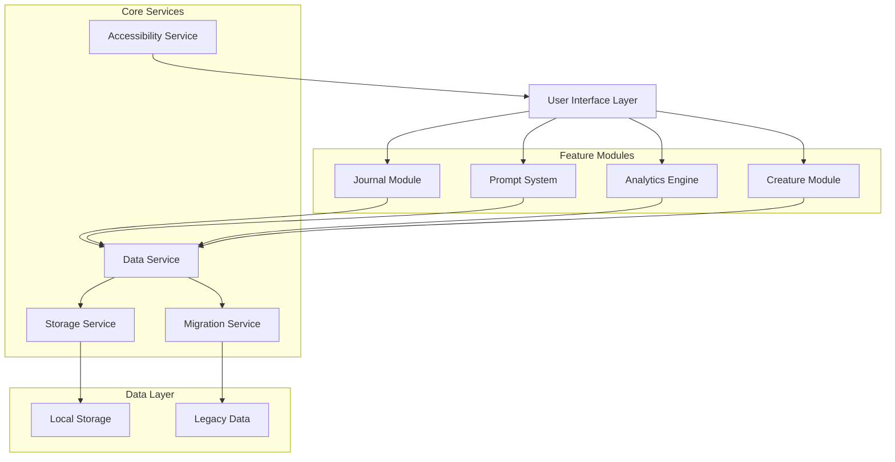

# Design Document

## Overview

EmoChild v3 transforms the digital emotional companion into a comprehensive reflective journaling and insight platform while preserving the gentle, gamified approach to emotional wellness. The system expands beyond simple emotion logging to include visual journaling with cozy stationery aesthetics, structured prompt systems for inner child and inner teenager work, and privacy-first emotional analytics with data visualizations. The architecture is designed for future mobile deployment while maintaining full accessibility and ethical boundaries around mental health support.

## Architecture

### System Architecture



### Mobile-Ready Architecture Considerations

- **Storage Abstraction**: Use a storage service layer that can adapt between localStorage (web) and native storage (mobile)
- **Responsive Design**: All components built with mobile-first responsive principles
- **Touch-Friendly Interactions**: Interface elements sized and spaced for touch input
- **Offline-First**: All functionality works without network connectivity
- **Performance Optimization**: Lazy loading and efficient rendering for mobile constraints

## Components and Interfaces

### Journal Module Components

#### JournalSpread Component
```typescript
interface JournalSpreadProps {
  currentDate: Date;
  entry?: JournalEntry;
  isEditing: boolean;
  onSave: (content: string, linkedEmotions?: string[]) => void;
  onCancel: () => void;
  onPageTurn: (direction: 'next' | 'previous') => void;
  canTurnNext: boolean;
  canTurnPrevious: boolean;
}
```

**Visual Design**: 
- Two-page spread layout matching the provided journal image
- Each page represents one day of the year (365 total pages)
- Dark pink (#D4567A) borders with rounded corners
- Light pink (#F8E8ED) page background
- Page curl animation effects for turning pages
- Cozy, minimal aesthetic with subtle shadows and page depth
- Handwriting-style font for text input areas
- Tilde placeholders (~) for empty content areas
- Date header on each page showing the day of year

#### JournalNavigation Component
```typescript
interface JournalNavigationProps {
  currentDate: Date;
  entries: JournalEntry[];
  onDateSelect: (date: Date) => void;
  onTodayJump: () => void;
  onExportCSV: () => void;
  hasEntryForDate: (date: Date) => boolean;
}
```

#### PageCurl Component
```typescript
interface PageCurlProps {
  direction: 'next' | 'previous';
  onCurl: () => void;
  disabled: boolean;
  animationDuration: number;
}
```

#### EmotionLinker Component
```typescript
interface EmotionLinkerProps {
  availableEmotions: EmotionLog[];
  linkedEmotions: string[];
  onToggleEmotion: (emotionId: string) => void;
}
```

### Prompt System Components

#### PromptTrackSelector Component
```typescript
interface PromptTrackSelectorProps {
  tracks: PromptTrack[];
  selectedTrack?: string;
  onSelectTrack: (trackId: string) => void;
}
```

#### DailyPrompt Component
```typescript
interface DailyPromptProps {
  prompt: Prompt;
  isOptional: boolean;
  onComplete?: (response: string) => void;
  onSkip: () => void;
}
```

### Analytics Engine Components

#### InsightDashboard Component
```typescript
interface InsightDashboardProps {
  emotionData: EmotionLog[];
  journalData: JournalEntry[];
  timeRange: TimeRange;
  onTimeRangeChange: (range: TimeRange) => void;
}
```

#### EmotionChart Component
```typescript
interface EmotionChartProps {
  data: ChartData;
  chartType: 'pie' | 'line' | 'bar';
  colorScheme: 'pastel';
  accessibleDescription: string;
}
```

#### PatternVisualization Component
```typescript
interface PatternVisualizationProps {
  patterns: EmotionalPattern[];
  visualType: 'streak' | 'frequency' | 'ratio';
  showEncouragement: boolean;
}
```

## Data Models

### Extended Journal Entry Model
```typescript
interface JournalEntry {
  id: string;
  content: string;
  date: Date; // Specific day this entry represents (one per day max)
  createdAt: Date;
  updatedAt: Date;
  linkedEmotions: string[]; // References to EmotionLog IDs
  wordCount: number;
  tags?: string[];
  dayOfYear: number; // 1-365, for easy page navigation
}
```

### Journal Page Model
```typescript
interface JournalPage {
  date: Date;
  dayOfYear: number;
  hasEntry: boolean;
  entry?: JournalEntry;
  isToday: boolean;
  isFuture: boolean;
}
```

### Prompt System Models
```typescript
interface PromptTrack {
  id: 'inner-child' | 'inner-teenager';
  name: string;
  description: string;
  totalPrompts: number; // 365 for full year
  currentDay: number;
}

interface Prompt {
  id: string;
  trackId: string;
  dayNumber: number; // 1-365
  content: string;
  category: string; // e.g., 'safety', 'play', 'identity', 'boundaries'
  isCompleted: boolean;
  response?: string;
  completedAt?: Date;
}
```

### Analytics Data Models
```typescript
interface EmotionalPattern {
  type: 'expression-ratio' | 'common-emotions' | 'streak' | 'trend';
  timeRange: TimeRange;
  data: PatternData;
  insight: string;
  encouragement?: string;
}

interface ChartData {
  labels: string[];
  datasets: {
    label: string;
    data: number[];
    backgroundColor: string[];
    borderColor: string[];
  }[];
}

interface TimeRange {
  start: Date;
  end: Date;
  preset?: 'week' | 'month' | 'quarter' | 'year';
}
```

### Extended Storage Schema
```typescript
interface EmoChildV3Storage extends EmoChildV2Storage {
  journalEntries: JournalEntry[];
  promptTracks: PromptTrack[];
  prompts: Prompt[];
  analyticsPreferences: {
    defaultTimeRange: TimeRange;
    enabledInsights: string[];
    lastViewedInsights: Date;
  };
  migrationVersion: string;
}
```

## Correctness Properties

*A property is a characteristic or behavior that should hold true across all valid executions of a system-essentially, a formal statement about what the system should do. Properties serve as the bridge between human-readable specifications and machine-verifiable correctness guarantees.*

### Property Reflection

After reviewing all testable properties from the prework analysis, I've identified several areas where properties can be consolidated or where redundancy exists:

**Consolidation Opportunities:**
- Properties 1.3, 2.1, and 2.2 all relate to data persistence and export - these can be combined into comprehensive data handling properties
- Properties 5.1, 5.2, 5.3, and 5.4 all relate to data migration - these can be consolidated into migration correctness properties
- Properties 6.3 and 6.5 both relate to accessibility alternatives - these can be combined
- Properties 8.1, 8.2, 8.3, and 8.4 all relate to mobile compatibility - these can be consolidated

**Unique Value Properties:**
- Journal entry ordering and linking (1.4, 1.5)
- Prompt system behavior (3.2, 3.5)
- Analytics privacy (4.2)
- Each consolidated group provides distinct validation value

Property 1: Journal data persistence and export
*For any* valid journal entry with content and optional emotion links, saving the entry should store it locally with the correct date association, and exporting should include all entry data with timestamps and linked emotions in CSV format
**Validates: Requirements 1.3, 2.1, 2.2**

Property 2: Journal page navigation and ordering
*For any* date within the year, navigating to that page should display the correct day with any existing entry, and page turning should move sequentially through days in chronological order
**Validates: Requirements 1.4**

Property 3: Emotion linking consistency
*For any* journal entry and emotion log created on the same day, the linking system should correctly associate them when the user chooses to link emotions
**Validates: Requirements 1.5**

Property 4: Daily prompt unlocking behavior
*For any* given day, the prompt system should unlock exactly one unique prompt per track without requiring engagement or completion
**Validates: Requirements 3.2**

Property 5: Prompt accessibility without penalties
*For any* prompt that a user chooses to skip, the system should maintain full access to all features without displaying negative messages or reducing functionality
**Validates: Requirements 3.5**

Property 6: Analytics local processing privacy
*For any* emotional data being analyzed, all computation should occur locally without external network requests or data transmission
**Validates: Requirements 4.2**

Property 7: Data migration preservation
*For any* valid legacy data structure from previous EmoChild versions, the migration process should preserve all emotion logs and creature state while providing defaults for missing fields
**Validates: Requirements 5.1, 5.2, 5.3, 5.4**

Property 8: Accessibility alternative provision
*For any* visual element including charts and aesthetic components, the system should provide text alternatives and ensure full functionality through non-visual means
**Validates: Requirements 6.3, 6.5**

Property 9: Mobile compatibility architecture
*For any* new feature implementation, the code should use only mobile-compatible APIs, responsive design, and touch-friendly interfaces suitable for Android APK packaging
**Validates: Requirements 8.1, 8.2, 8.3, 8.4**

## Error Handling

### Journal Module Error Handling
- **Storage Failures**: Graceful degradation with user notification and retry mechanisms
- **Large Entry Handling**: Content size limits with user feedback before truncation
- **Corrupted Entry Recovery**: Backup mechanisms and data validation on load
- **Export Failures**: Clear error messages with alternative export options

### Prompt System Error Handling
- **Missing Prompt Data**: Fallback prompts and graceful loading states
- **Date Calculation Errors**: Robust date handling with timezone considerations
- **Prompt Loading Failures**: Retry mechanisms and offline prompt caching

### Analytics Engine Error Handling
- **Insufficient Data**: Meaningful placeholder states and progressive disclosure
- **Calculation Errors**: Fallback to simpler metrics and error logging
- **Visualization Failures**: Text-based alternatives and accessibility compliance

### Data Migration Error Handling
- **Schema Mismatch**: Version detection and step-by-step migration paths
- **Corrupted Legacy Data**: Partial recovery with user notification of data loss
- **Storage Quota Exceeded**: Data cleanup suggestions and export options

## Testing Strategy

### Dual Testing Approach

This design requires both unit testing and property-based testing to ensure comprehensive coverage:

**Unit Testing Focus:**
- Specific UI component rendering and interaction examples
- Edge cases like empty data states and boundary conditions
- Integration points between journal, prompts, and analytics modules
- Accessibility compliance for specific interface elements
- Error handling scenarios with known failure conditions

**Property-Based Testing Focus:**
- Universal properties using **fast-check** library for TypeScript/JavaScript
- Each property-based test configured to run minimum 100 iterations
- Data persistence and migration behavior across various input combinations
- Analytics calculations with different data patterns
- Mobile compatibility across different screen sizes and interaction patterns

**Property-Based Testing Requirements:**
- Use **fast-check** as the property-based testing library
- Configure each test for minimum 100 iterations for thorough randomized testing
- Tag each property-based test with format: **Feature: emochild-v3, Property {number}: {property_text}**
- Each correctness property must be implemented by exactly one property-based test
- Focus on testing universal behaviors rather than specific examples

**Testing Integration:**
- Unit tests verify concrete examples work correctly
- Property tests verify general correctness across all valid inputs
- Together they provide comprehensive coverage: unit tests catch specific bugs, property tests verify universal correctness
- Both types are essential and complement each other in ensuring system reliability

### Visual Design System

#### Color Palette
- **Primary Pink**: #D4567A (dark pink borders)
- **Secondary Pink**: #F8E8ED (light pink pages)
- **Accent Colors**: Soft pastels for data visualizations
- **Text Colors**: High contrast dark grays for accessibility
- **Success Green**: #A8D5A8 (gentle, non-alarming)
- **Warning Amber**: #F4D03F (soft, non-threatening)

#### Typography
- **Headers**: Clean, modern sans-serif for navigation and titles
- **Body Text**: Readable sans-serif for general content
- **Journal Text**: Handwriting-style font for journal entries to enhance cozy aesthetic
- **Data Labels**: Monospace for precise data display in analytics

#### Spacing and Layout
- **Mobile-First**: Responsive grid system starting from 320px width
- **Touch Targets**: Minimum 44px for all interactive elements
- **Comfortable Spacing**: Generous padding and margins for relaxed feel
- **Visual Hierarchy**: Clear information architecture with consistent spacing ratios

#### Animation and Transitions
- **Gentle Transitions**: Soft, slow animations (300-500ms) for state changes
- **Page Curl Effects**: Realistic page turning animations with CSS transforms and shadows
- **Reduced Motion**: Respect user preferences for reduced motion with simplified page transitions
- **Loading States**: Calming, non-intrusive loading indicators
- **Micro-Interactions**: Subtle feedback for user actions without overwhelming
- **Page Depth**: Subtle 3D effects to simulate book thickness and page layering

### Data Visualization Design

#### Chart Types and Styling
- **Emotion Frequency**: Soft pie charts with pastel color segments
- **Expression Ratios**: Gentle bar charts with rounded corners
- **Trend Patterns**: Smooth line charts with soft gradients
- **Streak Visualizations**: Calendar-style grids with gentle highlighting

#### Accessibility in Visualizations
- **Color Independence**: Patterns and textures in addition to color coding
- **Text Alternatives**: Comprehensive alt text and data table alternatives
- **Screen Reader Support**: ARIA labels and structured data presentation
- **High Contrast Mode**: Alternative styling for high contrast preferences

#### Encouraging Design Language
- **No Scores or Rankings**: Avoid competitive or judgmental metrics
- **Positive Framing**: Focus on growth and awareness rather than deficits
- **Gentle Encouragement**: Supportive messages for low activity periods
- **Progress Celebration**: Acknowledge patterns without creating pressure