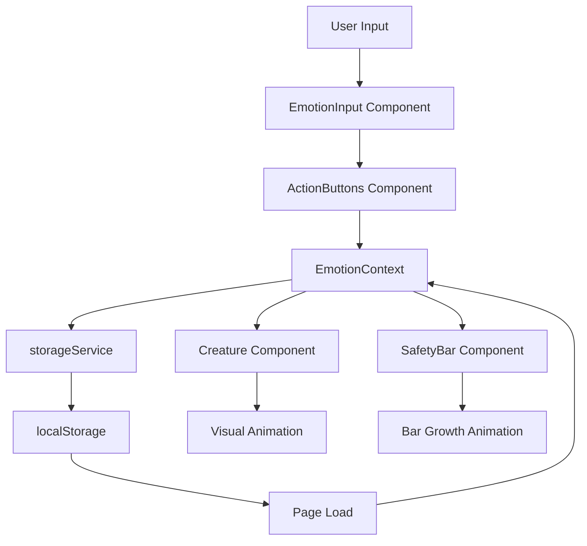

# Design Document

## Overview

EmoChild is a single-page web application built with Next.js that provides an emotional wellness companion through gamification. The application consists of three primary views: the Emotion Log Screen (primary interface), the Creature Screen (visual feedback), and the History Screen (reflection). All data is stored locally in the browser using localStorage, ensuring complete privacy without requiring backend infrastructure.

The application uses a dark pastel aesthetic with deep charcoal backgrounds (#1a1a1a) and soft accent colors (mint #b4f8c8, lavender #c5b9e2, peach #ffd4a3, baby blue #a0d2eb, blush pink #F2C6DE). The creature responds to user actions with smooth CSS animations and transitions, creating an emotionally supportive experience.

## Architecture

### Technology Stack

- **Framework**: Next.js 14+ (App Router)
- **Language**: TypeScript for type safety
- **Styling**: CSS Modules with CSS custom properties for theming
- **State Management**: React Context API for global state
- **Storage**: Browser localStorage API
- **Animation**: CSS transitions and keyframe animations
- **Build Tool**: Next.js built-in bundler

### Application Structure

```
emochild/
├── src/
│   ├── app/
│   │   ├── layout.tsx          # Root layout with theme provider
│   │   ├── page.tsx            # Main page (Emotion Log Screen)
│   │   ├── history/
│   │   │   └── page.tsx        # History view
│   │   └── globals.css         # Global styles and CSS variables
│   ├── components/
│   │   ├── EmotionInput/       # Emotion log input component
│   │   ├── ActionButtons/      # Express/Suppress buttons
│   │   ├── Creature/           # Animated creature component
│   │   ├── SafetyBar/          # Inner safety bar component
│   │   ├── LogHistory/         # History list component
│   │   └── Navigation/         # Simple navigation component
│   ├── context/
│   │   └── EmotionContext.tsx  # Global state management
│   ├── services/
│   │   └── storageService.ts   # localStorage abstraction
│   ├── types/
│   │   └── index.ts            # TypeScript type definitions
│   └── utils/
│       ├── creatureState.ts    # Creature state calculation logic
│       └── animations.ts       # Animation helper functions
└── public/
    └── creature/               # Creature SVG assets (if needed)
```

### Data Flow



## Components and Interfaces

### Core Data Types

```typescript
// types/index.ts

export type EmotionAction = 'expressed' | 'suppressed';

export interface EmotionLog {
  id: string;
  text: string;
  action: EmotionAction;
  timestamp: number;
}

export interface CreatureState {
  brightness: number;      // 0-100
  size: number;            // 0-100
  animation: 'idle' | 'grow' | 'curl' | 'celebrate';
}

export interface AppState {
  logs: EmotionLog[];
  creatureState: CreatureState;
  safetyScore: number;     // Count of expressed emotions
}
```

### Component Interfaces

#### EmotionInput Component

```typescript
interface EmotionInputProps {
  onSubmit: (text: string, action: EmotionAction) => void;
  maxLength: number;
}
```

Responsibilities:
- Render text input with character counter
- Validate input length (max 100 characters)
- Disable submission for empty input
- Auto-focus on mount and after submission
- Display remaining character count

#### ActionButtons Component

```typescript
interface ActionButtonsProps {
  onExpress: () => void;
  onSuppress: () => void;
  disabled: boolean;
}
```

Responsibilities:
- Render "Express" and "Suppress" buttons
- Disable buttons when no text is entered
- Apply appropriate pastel colors (mint for express, lavender for suppress)
- Provide visual feedback on click

#### Creature Component

```typescript
interface CreatureProps {
  state: CreatureState;
}
```

Responsibilities:
- Render animated creature SVG or CSS-based shape
- Apply brightness filter based on state.brightness
- Apply scale transform based on state.size
- Trigger animations based on state.animation
- Display idle breathing animation when state is 'idle'
- Display growth animation when state is 'grow'
- Display curling animation when state is 'curl'
- Display celebration animation when state is 'celebrate'

#### SafetyBar Component

```typescript
interface SafetyBarProps {
  score: number;
  maxScore?: number;
}
```

Responsibilities:
- Render progress bar with fill percentage
- Display numeric score
- Animate bar growth with 0.5s transition
- Use mint pastel color for fill

#### LogHistory Component

```typescript
interface LogHistoryProps {
  logs: EmotionLog[];
}
```

Responsibilities:
- Display logs in reverse chronological order
- Format timestamps as human-readable dates
- Apply visual indicators for expressed vs suppressed
- Show empty state message when no logs exist
- Implement scrolling for long lists

### Storage Service Interface

```typescript
// services/storageService.ts

export interface StorageService {
  saveLogs(logs: EmotionLog[]): void;
  loadLogs(): EmotionLog[];
  saveCreatureState(state: CreatureState): void;
  loadCreatureState(): CreatureState | null;
  saveSafetyScore(score: number): void;
  loadSafetyScore(): number;
  clearAll(): void;
}
```

## Data Models

### EmotionLog Model

```typescript
{
  id: string;           // UUID v4
  text: string;         // 1-100 characters
  action: 'expressed' | 'suppressed';
  timestamp: number;    // Unix timestamp in milliseconds
}
```

Storage key: `emochild_logs`

### CreatureState Model

```typescript
{
  brightness: number;   // 0-100, starts at 50
  size: number;         // 0-100, starts at 50
  animation: 'idle' | 'grow' | 'curl' | 'celebrate';
}
```

Storage key: `emochild_creature`

State calculation rules:
- Each "expressed" action: brightness +5, size +2 (max 100)
- Each "suppressed" action: brightness -3, size -1 (min 0)
- Animation triggered based on action type
- After animation completes (1s), return to 'idle'

### SafetyScore Model

```typescript
{
  score: number;        // Count of expressed emotions, starts at 0
}
```

Storage key: `emochild_safety`

Calculation: Increment by 1 for each "expressed" action only.

## State Management

### EmotionContext

The EmotionContext provides global state management using React Context API:

```typescript
interface EmotionContextType {
  logs: EmotionLog[];
  creatureState: CreatureState;
  safetyScore: number;
  addLog: (text: string, action: EmotionAction) => void;
  clearLogs: () => void;
}
```

Context responsibilities:
- Maintain current application state
- Provide methods to update state
- Persist changes to localStorage via storageService
- Calculate new creature state based on actions
- Update safety score for expressed emotions

### State Update Flow

1. User submits emotion log with action
2. Context creates new EmotionLog object with UUID and timestamp
3. Context calculates new creature state based on action
4. Context updates safety score if action is "expressed"
5. Context persists all changes to localStorage
6. Context triggers re-render of dependent components
7. Creature component animates based on new state
8. SafetyBar component animates growth if applicable

## UI Layout Design

### Main Page (Emotion Log Screen)

```
┌─────────────────────────────────────┐
│                                     │
│         [Creature Display]          │
│        (animated, glowing)          │
│                                     │
├─────────────────────────────────────┤
│                                     │
│      [Inner Safety Bar: 12 ✨]     │
│      ████████░░░░░░░░░░░░░░         │
│                                     │
├─────────────────────────────────────┤
│                                     │
│  ┌───────────────────────────────┐ │
│  │ How are you feeling?          │ │
│  │ [text input]                  │ │
│  │                      47/100   │ │
│  └───────────────────────────────┘ │
│                                     │
│  [Express 🌱]    [Suppress 🌑]     │
│                                     │
├─────────────────────────────────────┤
│                                     │
│  [View History]                     │
│                                     │
└─────────────────────────────────────┘
```

Layout specifications:
- Creature occupies top 40% of viewport
- Safety bar below creature, centered
- Emotion input centered in middle section
- Action buttons side-by-side, equal width
- Navigation link at bottom
- All elements have comfortable padding (16-24px)

### History Screen

```
┌─────────────────────────────────────┐
│  ← Back to Creature                 │
│                                     │
│  Your Emotional Journey             │
│                                     │
├─────────────────────────────────────┤
│                                     │
│  🌱 Today, 2:34 PM                  │
│  "Felt anxious about presentation"  │
│                                     │
│  🌑 Today, 11:20 AM                 │
│  "Ignored frustration with coworker"│
│                                     │
│  🌱 Yesterday, 8:15 PM              │
│  "Acknowledged sadness about..."    │
│                                     │
│  [... scrollable list ...]          │
│                                     │
└─────────────────────────────────────┘
```

Layout specifications:
- Back navigation at top
- Title centered below navigation
- Logs displayed as cards with 12px margin
- Each card shows icon, timestamp, and text
- Expressed logs use mint accent (#b4f8c8)
- Suppressed logs use muted lavender (#8b7fa8)
- Scrollable container for overflow

## Visual Design System

### Color Palette (CSS Custom Properties)

```css
:root {
  /* Background */
  --color-bg-primary: #1a1a1a;
  --color-bg-secondary: #2d2d2d;
  
  /* Pastels */
  --color-mint: #b4f8c8;
  --color-lavender: #c5b9e2;
  --color-peach: #ffd4a3;
  --color-blue: #a0d2eb;
  --color-pink: #F2C6DE;
  /* Text */
  --color-text-primary: #f5f5f5;
  --color-text-secondary: #b0b0b0;
  
  /* Creature glow */
  --glow-mint: 0 0 20px rgba(180, 248, 200, 0.6);
  --glow-lavender: 0 0 20px rgba(197, 185, 226, 0.6);
  
  /* Spacing */
  --spacing-xs: 8px;
  --spacing-sm: 12px;
  --spacing-md: 16px;
  --spacing-lg: 24px;
  --spacing-xl: 32px;
  
  /* Animation */
  --transition-fast: 0.2s ease;
  --transition-medium: 0.5s ease;
  --transition-slow: 1s ease;
}
```

### Typography

- Primary font: System font stack for performance
- Headings: 24px, weight 600
- Body text: 16px, weight 400
- Small text (timestamps): 14px, weight 400
- Character counter: 12px, weight 500

### Animation Specifications

#### Creature Idle Animation

```css
@keyframes breathe {
  0%, 100% { transform: scale(1) translateY(0); }
  50% { transform: scale(1.02) translateY(-2px); }
}

.creature-idle {
  animation: breathe 3s ease-in-out infinite;
}
```

#### Creature Grow Animation

```css
@keyframes grow {
  0% { transform: scale(1); filter: brightness(1); }
  50% { transform: scale(1.15); filter: brightness(1.3); }
  100% { transform: scale(1.05); filter: brightness(1.1); }
}

.creature-grow {
  animation: grow 1s ease-out forwards;
}
```

#### Creature Curl Animation

```css
@keyframes curl {
  0% { transform: scale(1) rotate(0deg); filter: brightness(1); }
  50% { transform: scale(0.9) rotate(-5deg); filter: brightness(0.7); }
  100% { transform: scale(0.95) rotate(-2deg); filter: brightness(0.8); }
}

.creature-curl {
  animation: curl 1s ease-out forwards;
}
```

#### Safety Bar Growth

```css
.safety-bar-fill {
  transition: width var(--transition-medium);
}
```

## Creature State Logic

### State Calculation Algorithm

```typescript
// utils/creatureState.ts

export function calculateNewState(
  currentState: CreatureState,
  action: EmotionAction
): CreatureState {
  const brightnessChange = action === 'expressed' ? 5 : -3;
  const sizeChange = action === 'expressed' ? 2 : -1;
  
  const newBrightness = Math.max(0, Math.min(100, 
    currentState.brightness + brightnessChange
  ));
  
  const newSize = Math.max(0, Math.min(100, 
    currentState.size + sizeChange
  ));
  
  let animation: CreatureState['animation'];
  if (action === 'expressed') {
    animation = newBrightness === 100 ? 'celebrate' : 'grow';
  } else {
    animation = 'curl';
  }
  
  return {
    brightness: newBrightness,
    size: newSize,
    animation
  };
}

export function getInitialState(): CreatureState {
  return {
    brightness: 50,
    size: 50,
    animation: 'idle'
  };
}
```

### Creature Visual Representation

The creature can be implemented as:
1. **Simple CSS shape**: A rounded blob with gradient and glow
2. **SVG**: A simple character shape with paths
3. **Emoji-based**: Using emoji with CSS filters and transforms

Recommended approach: CSS-based blob for simplicity and performance.

```css
.creature {
  width: 120px;
  height: 120px;
  border-radius: 50% 50% 45% 45%;
  background: radial-gradient(circle, var(--color-mint), var(--color-lavender));
  box-shadow: var(--glow-mint);
  position: relative;
}

.creature::before,
.creature::after {
  content: '';
  position: absolute;
  width: 12px;
  height: 12px;
  background: var(--color-bg-primary);
  border-radius: 50%;
  top: 40%;
}

.creature::before { left: 30%; }
.creature::after { right: 30%; }
```


## Correctness Properties

*A property is a characteristic or behavior that should hold true across all valid executions of a system-essentially, a formal statement about what the system should do. Properties serve as the bridge between human-readable specifications and machine-verifiable correctness guarantees.*

### Property 1: Input length constraint enforcement

*For any* text input to the emotion log field, the displayed character counter should always show the correct number of remaining characters (100 minus current length), and the input should never contain more than 100 characters.

**Validates: Requirements 1.2, 1.3**

### Property 2: Emotion log persistence round-trip

*For any* valid emotion log (with text, action type, and timestamp), saving it to storage and then loading from storage should produce an equivalent log with all fields preserved.

**Validates: Requirements 2.2, 2.3, 5.1, 5.2, 5.3**

### Property 3: Input clearing after submission

*For any* emotion log submission (expressed or suppressed), the input field should be empty immediately after the action completes.

**Validates: Requirements 2.4**

### Property 4: Creature brightness responds to actions

*For any* sequence of emotion logs, the creature brightness should increase by 5 for each "expressed" action and decrease by 3 for each "suppressed" action, bounded between 0 and 100.

**Validates: Requirements 3.1, 3.2**

### Property 5: Safety score only counts expressions

*For any* sequence of emotion logs, the safety score should equal the count of logs with "expressed" action type, and should never decrease.

**Validates: Requirements 4.1, 4.2**

### Property 6: Safety bar displays current score

*For any* application state, the displayed safety bar numeric value should match the count of expressed emotions in the stored logs.

**Validates: Requirements 4.4**

### Property 7: State persistence round-trip

*For any* application state (logs, creature state, safety score), saving to localStorage and then loading on page refresh should restore the complete state with all values preserved.

**Validates: Requirements 4.5, 9.5**

### Property 8: Log history chronological ordering

*For any* set of emotion logs, when displayed in the history view, they should appear in reverse chronological order (newest first) based on their timestamps.

**Validates: Requirements 6.1**

### Property 9: Log display completeness

*For any* emotion log displayed in the history, the rendered output should contain the timestamp, the emotion text, and a visual indicator of the action type.

**Validates: Requirements 6.2, 6.5**

### Property 10: Text contrast accessibility

*For any* text element displayed on the dark background, the contrast ratio between text color and background color should meet WCAG AA standards (minimum 4.5:1 for normal text).

**Validates: Requirements 7.3**

### Property 11: Focus indicator presence

*For any* interactive element (button or input), when it receives focus, it should have a visible focus indicator with pastel accent color.

**Validates: Requirements 7.5**

### Property 12: No external network requests

*For any* user interaction with the application, the browser should not make HTTP requests to external servers for user data operations.

**Validates: Requirements 9.2**

## Error Handling

### Input Validation Errors

- **Empty input submission**: Display inline message "Share a feeling to continue" in peach accent color
- **localStorage quota exceeded**: Display toast notification "Storage full - some logs may not save" and continue operation
- **Invalid character in input**: Sanitize by removing non-printable characters silently

### Storage Errors

- **localStorage not available**: Fall back to in-memory storage with warning banner "Data won't persist between sessions"
- **Corrupted data in localStorage**: Clear corrupted data, start fresh, log error to console
- **Parse errors**: Catch JSON parse errors, use default initial state

### Animation Errors

- **Animation not supported**: Gracefully degrade to instant state changes without animation
- **Performance issues**: Reduce animation complexity if frame rate drops below 30fps

### Error Display Strategy

- Use non-intrusive toast notifications for non-critical errors
- Use inline validation messages for input errors
- Never block user interaction due to errors
- Always maintain current session state even if persistence fails
- Log all errors to console for debugging

## Testing Strategy

### Unit Testing

The application will use **Vitest** as the testing framework for unit tests, chosen for its speed, native ESM support, and excellent TypeScript integration.

Unit tests will cover:

- **Component rendering**: Verify components render with correct props
- **User interactions**: Test button clicks, input changes, form submissions
- **Edge cases**: Empty states, maximum values, boundary conditions
- **Error conditions**: localStorage failures, invalid inputs
- **Utility functions**: creatureState calculations, date formatting

Example unit test structure:

```typescript
// components/EmotionInput/EmotionInput.test.tsx
import { render, screen, fireEvent } from '@testing-library/react';
import { EmotionInput } from './EmotionInput';

describe('EmotionInput', () => {
  it('should disable submit when input is empty', () => {
    render(<EmotionInput onSubmit={vi.fn()} maxLength={100} />);
    const input = screen.getByRole('textbox');
    expect(input).toHaveValue('');
    // Verify buttons are disabled
  });
  
  it('should prevent input exceeding max length', () => {
    // Test edge case for 100+ character input
  });
});
```

### Property-Based Testing

The application will use **fast-check** as the property-based testing library, chosen for its excellent TypeScript support and comprehensive generator library.

Property-based tests will be configured to run a minimum of 100 iterations per property to ensure thorough coverage of the input space.

Each property-based test will be tagged with a comment explicitly referencing the correctness property from this design document using the format: `**Feature: emochild, Property {number}: {property_text}**`

Property-based tests will verify:

- **Property 1**: Input length constraints with random strings
- **Property 2**: Storage round-trip with random emotion logs
- **Property 3**: Input clearing with random submissions
- **Property 4**: Brightness calculations with random action sequences
- **Property 5**: Safety score with random action sequences
- **Property 6**: Score display with random states
- **Property 7**: Full state persistence with random app states
- **Property 8**: Chronological ordering with random log sets
- **Property 9**: Display completeness with random logs
- **Property 10**: Contrast ratios with color combinations
- **Property 11**: Focus indicators on all interactive elements
- **Property 12**: Network isolation with random interactions

Example property-based test structure:

```typescript
// services/storageService.test.ts
import fc from 'fast-check';
import { storageService } from './storageService';

/**
 * Feature: emochild, Property 2: Emotion log persistence round-trip
 * For any valid emotion log, saving and loading should preserve all fields
 */
describe('Property 2: Storage round-trip', () => {
  it('should preserve emotion logs through save/load cycle', () => {
    fc.assert(
      fc.property(
        fc.record({
          id: fc.uuid(),
          text: fc.string({ minLength: 1, maxLength: 100 }),
          action: fc.constantFrom('expressed', 'suppressed'),
          timestamp: fc.integer({ min: 0 })
        }),
        (log) => {
          storageService.saveLogs([log]);
          const loaded = storageService.loadLogs();
          expect(loaded[0]).toEqual(log);
        }
      ),
      { numRuns: 100 }
    );
  });
});
```

### Integration Testing

Integration tests will verify:
- Complete user flows (log emotion → see creature react → view history)
- Context provider integration with components
- localStorage integration with state management
- Navigation between screens

### Testing Approach

1. **Implementation-first development**: Implement features before writing tests
2. **Test after implementation**: Write unit tests and property tests after core functionality works
3. **Iterative refinement**: Use test failures to identify and fix bugs
4. **Property tests for core logic**: Use property-based testing for state calculations and data transformations
5. **Unit tests for UI**: Use unit tests for component behavior and user interactions

## Performance Considerations

### Initial Load Performance

- Target: < 3 seconds on 3G connection
- Minimize bundle size by avoiding heavy dependencies
- Use Next.js automatic code splitting
- Lazy load history screen component

### Runtime Performance

- Use CSS animations instead of JavaScript for creature animations
- Debounce localStorage writes if needed (currently immediate is fine)
- Limit history display to 100 most recent logs initially
- Use React.memo for creature component to prevent unnecessary re-renders

### Storage Performance

- localStorage operations are synchronous but fast for small data
- Estimate: 1000 logs = ~100KB, well within 5-10MB localStorage limits
- No optimization needed unless user has 10,000+ logs

## Accessibility

### Keyboard Navigation

- All interactive elements accessible via Tab key
- Enter key submits emotion log
- Escape key clears input
- Arrow keys navigate history list

### Screen Reader Support

- Semantic HTML elements (button, input, nav)
- ARIA labels for creature state ("Creature brightness: 75%")
- ARIA live regions for dynamic updates (safety score changes)
- Alt text for visual indicators

### Visual Accessibility

- High contrast text (WCAG AA compliant)
- Focus indicators on all interactive elements
- No reliance on color alone for information
- Respects prefers-reduced-motion for animations

## Future Enhancements

Potential features for future iterations:

1. **Export data**: Download emotion logs as JSON or CSV
2. **Creature customization**: Choose creature colors or shapes
3. **Insights dashboard**: Visualize emotional patterns over time
4. **Reminders**: Optional gentle notifications to check in
5. **Multiple creatures**: Different creatures for different emotional themes
6. **Sharing**: Generate shareable creature images (without private log data)
7. **Themes**: Additional color schemes beyond dark pastel
8. **Sounds**: Optional gentle sound effects for actions

These enhancements are not part of the initial MVP but are documented for future consideration.
